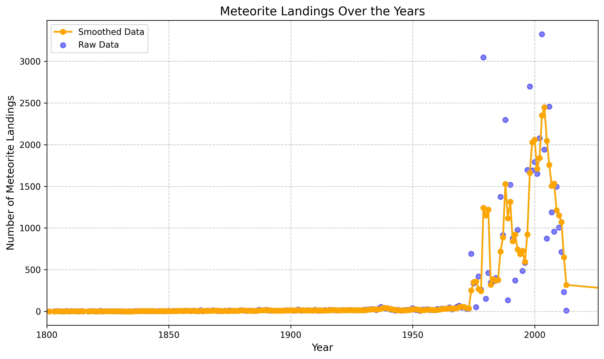
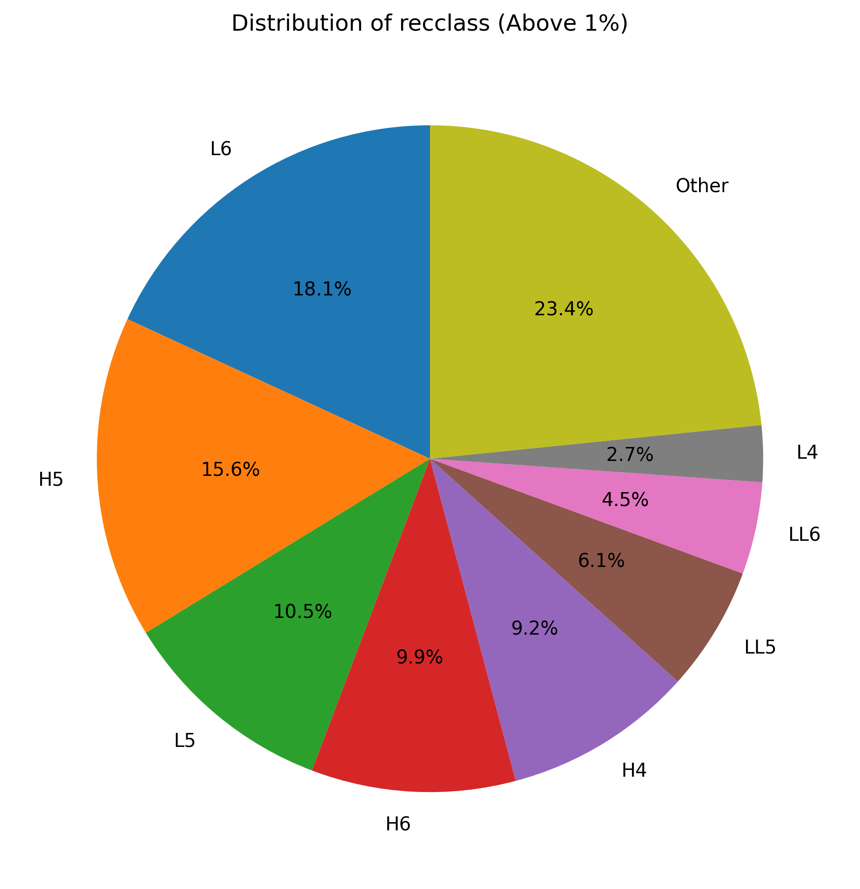
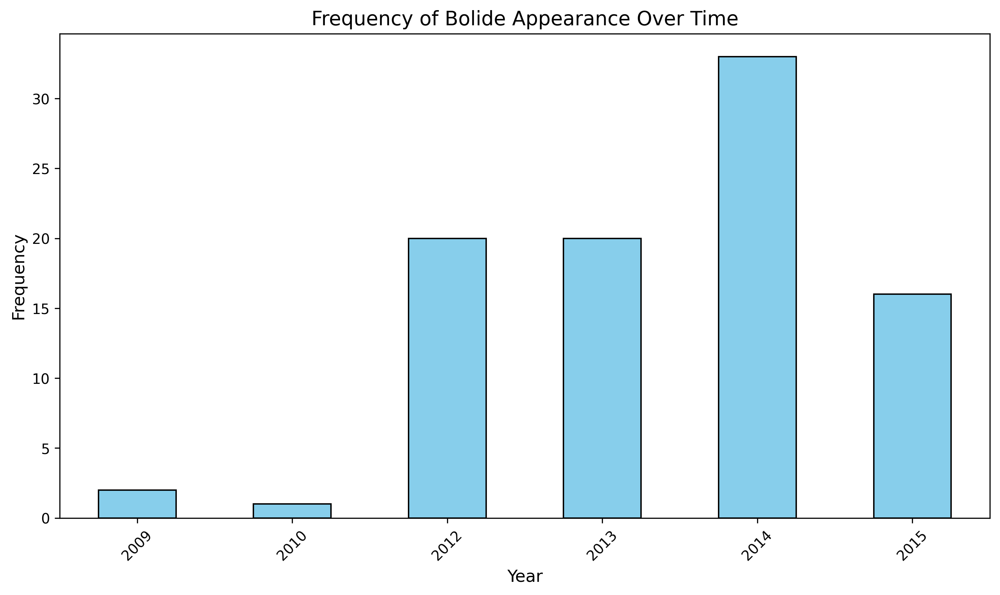

#  NASA Space Rocks: Meteorite & Bolide Data Analysis

## Project Overview
This project mines, cleans, and visualizes historical data regarding extraterrestrial impacts and atmospheric entries. By combining NASA's **Fireball and Bolide Reports** with the **Meteorite Landings** database, this analysis tracks the frequency, geographical distribution, and physical characteristics of space rocks interacting with Earth.

##  The Data
The analysis is built on two primary datasets:
* **Meteorite Landings:** Historical records of meteorites found on Earth, including their mass, classification, and discovery year.
* **Fireballs and Bolides:** Sensor data of exceptionally bright meteors burning up in the atmosphere, including velocity, altitude, and peak brightness timestamps.

##  Key Features & Visualizations
* **Data Harmonization:** Cleaned and merged distinct coordinate formats (converting strings like '12.3N' to functional float coordinates).
* **Temporal Trend Smoothing:** Utilized rolling averages to visualize the discovery rate of meteorites over the last two centuries.
* **Composition Analysis:** Filtered and mapped the distribution of major meteorite classes, grouping statistical outliers for cleaner visualization.
* **Global Impact Mapping:** Plotted verified meteorite landings and bolide atmospheric entries on a global map coordinate system.

## Results
* ** visualising the discovery rate of meteorites over the last two centuries.

* **Composition Analysis:** Filtered and mapped the distribution of major meteorite classes, grouping statistical outliers for cleaner visualization.

* **Frequecy of Bolides over the years
